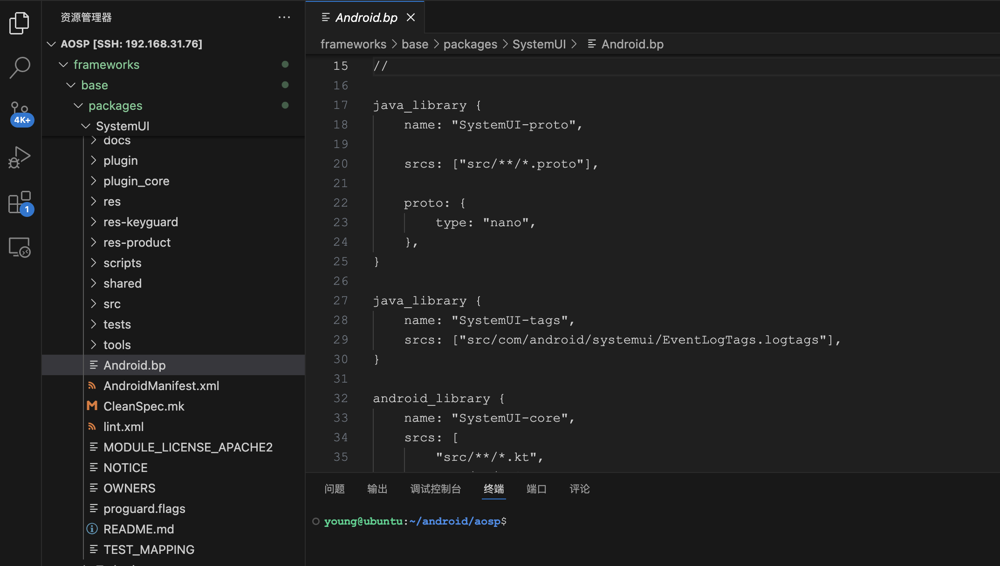
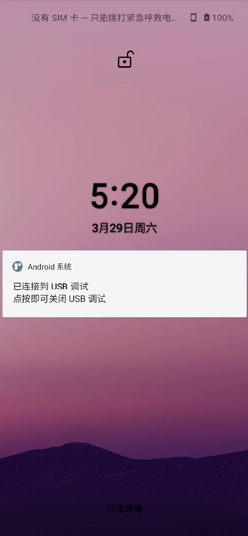

# Android 11 SystemUI 导入 Android studio 编译打包过程

## 0x00 AOSP环境准备

编译 AOSP 过程略，可以参考 [https://mirrors.tuna.tsinghua.edu.cn/help/AOSP/](https://mirrors.tuna.tsinghua.edu.cn/help/AOSP/) 

首先你要有一台 ubuntu 电脑或者虚拟机作为编译服务器，需要注意的是你的网络要流畅，否则同步的过程可能会比较痛苦（别问我为何会知道）。如果你是 APP 开发者可能 Mac 操作会比较顺手，可以通过 vscode 来连接你的 ubuntu 服务器。

本文使用的分支是 android-11.0.0_r9，硬件环境是 Pixel 5 手机



## 0x01 获取SystemUI源码

SystemUI 源码的目录在 `aosp/frameworks/base/packages/SystemUI`，将这个目录拷贝到你的工作目录后就可以开始项目改造了，主要的思想是添加 `build.gradle` 文件和相关库依赖。注意这一步需要保证 `gradle` 的版本不要太高，并且各个依赖库（ aar 或者 jar ）的版本尽可能保持一致。

使用 Android Studio 打开 SystemUI 目录

### 1. 配置 Gradle 版本为6.7.1


测试时发现使用 6.5 版本也是可以的。

### 2. 配置 Java 版本为1.8


## 0x02 添加相关依赖库

### 1. Jar 包依赖

- **framework.jar** `aosp/out/target/common/obj/JAVA_LIBRARIES/framework_intermediates/classes-header.jar`
- **core-all.jar**
  
    `aosp/out/soong/.intermediates/libcore/core-all/android_common/javac/core-all.jar`
    
- **SystemUI-statsd.jar**
  
    `aosp/out/soong/.intermediates/frameworks/base/packages/SystemUI/shared/SystemUI-statsd/android_common/javac/SystemUI-statsd.jar`
    
- **SystemUISharedLib.jar**
  
    `aosp/out/soong/.intermediates/frameworks/base/packages/SystemUI/shared/SystemUISharedLib/android_common/javac/SystemUISharedLib.jar`
    
- **SystemUI-proto.jar**
  
    `aosp/out/soong/.intermediates/frameworks/base/packages/SystemUI/SystemUI-proto/android_common/javac/SystemUI-proto.jar`
    
- **SystemUI-tags.jar**
  
    `aosp/out/soong/.intermediates/frameworks/base/packages/SystemUI/SystemUI-tags/android_common/javac/SystemUI-tags.jar`
    
- **libprotobuf-java-nano.jar**
  
    `aosp/out/soong/.intermediates/external/protobuf/libprotobuf-java-nano/android_common/javac/libprotobuf-java-nano.jar`
    
- **WindowManager-Shell.jar**
  
    `aosp/out/soong/.intermediates/frameworks/base/libs/WindowManager/Shell/WindowManager-Shell/android_common/javac/WindowManager-Shell.jar`
    

### 2. AAR 依赖

- **preference-1.2.0-alpha01.aar**
  
    `aosp/prebuilts/sdk/current/androidx/m2repository/androidx/preference/preference/1.2.0-alpha01/preference-1.2.0-alpha01.aar`
    
- **asynclayoutinflater-1.1.0-alpha01.aar**
  
    `aosp/prebuilts/sdk/current/androidx/m2repository/androidx/asynclayoutinflater/asynclayoutinflater/1.1.0-alpha01/asynclayoutinflater-1.1.0-alpha01.aar`
    

### 3. 源码模块依赖

- **SettingsLib 模块**
  
    `aosp/frameworks/base/packages/SettingsLib`
    
- **WifiTrackerLib 模块**
`aosp/frameworks/opt/net/wifi/libs/WifiTrackerLib`

## 0x03 语言文件处理


这里把 product 为 tv、device 以及 tablet 的 key 删除掉，使用 AI 写了一个 python 脚本进行处理。

可以查看本项目中 [remove-lang.py](http://remove-lang.py) 文件

## 0x04 签名文件

从 `aosp/build/target/product/security` 提取 `platform.pk8` 和 `platform.x509.pem` 签名文件 

```bash
# 将 platform.pk8 转成 platform.pem
openssl pkcs8 -in platform.pk8 -inform DER -out platform.pem -nocrypt
# 使用 platform.x509.pem 和 platform.pem 生成 platform.p12 并设置别名 platform 密码为 android
openssl pkcs12 -export -in platform.x509.pem -inkey platform.pem -out platform.p12 -name platform -password pass:android
# 生成最终的 platform.jks
keytool -importkeystore -deststorepass android -destkeystore platform.jks -srckeystore platform.p12 -srcstoretype PKCS12 -srcstorepass android
```

或者使用 https://github.com/getfatday/keytool-importkeypair 工具可以更加便捷生成签名文件

## 0x05 打包

修改下 StatusBar，添加下 Log


./gradlew assembleRelease

**安装运行**

```bash
adb root
adb remount
adb push build/outputs/apk/release/SystemUI.apk /system/system_ext/priv-app/SystemUI/SystemUI.apk

adb reboot
#adb shell stop
#adb shell start
```




## 0x06 引用

- https://github.com/siren-ocean/SystemUI